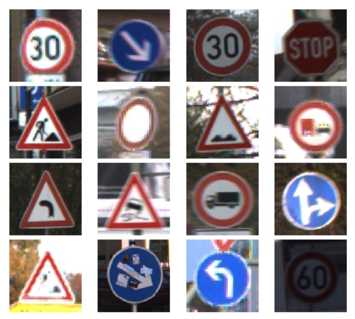
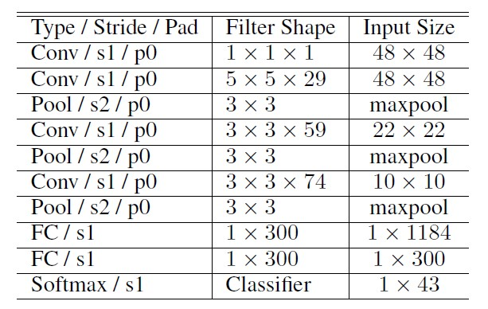
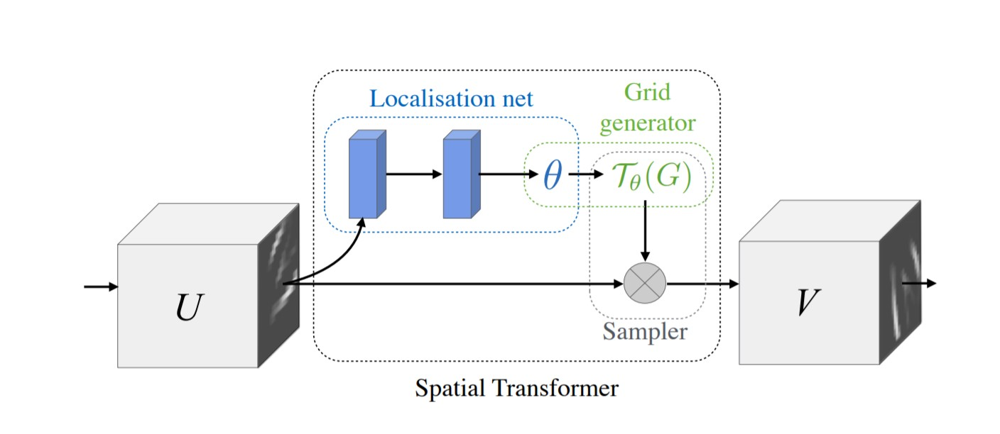
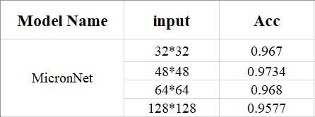
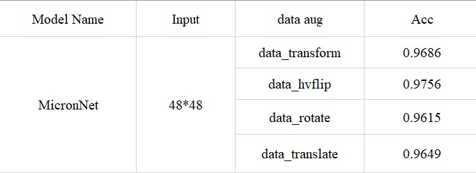
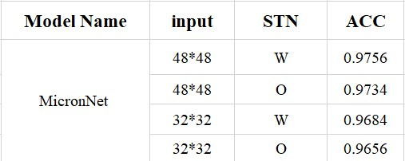

# 数图大作业


## 1. 现状调研

目前随着卷积神经网络的广泛应用，对于深度卷积网络在交通信号识别的主要挑战就是计算和存储方面.交通信号识别是计算机视觉在现实场景中应用的重要任务之一，现阶段由于深度卷积网络在特征提取方面的显著作用，大部分提升识别准确率的方法都是在改进卷积网络[1-3]。



尽管深度卷积神经网络已经在交通信号识别领域取得了较好的结果，但限制深度卷积网络在交通信号识别领域广泛应用的一个关键的问题就是深度卷积网络的高计算量以及存储的问题。例如，Ciresan[3]提出的卷积网络就包含大约385万个参数，而Jin[4]提出的网络则包含大约有232万个参数。因此，设计更加紧凑和高效的交通信号识别深度神经网路是非常有必要的。

目前，有很多的研究在关注和探索更加适合嵌入式设备的小型深度神经网络。例如，在Iandola等人[5]提出了设计微卷积网络结构的三种策略：（1）减少卷积核的数量；（2）减少输入通道数；（3）在网络中使用下采样。遵循这些设计原则，Iandola提出了SqueezeNet微型的卷积神经网络，它的参数量比AlexNet小了近50倍。在Howard等人[6]的工作中，他们使用了深度可分离卷积层去减少参数量，实现了参数量和检测准确率之间的平衡。Sandler[7]在此基础上使用了残差结构使得参数量进一步减少的同时保持网络检测的高性能。Aghdam[8]等人提出了一种优化深度神经网络架构的技术，以实现交通信号识别的目的。基于他们所构建的用于交通信号识别的微型深度神经网络，网络的参数量减少到了17.4万个，并且仍然可以实现较高的精度。


## 2. 研究方案

### 2.1 模型结构

在现有方法的基础上，构建一个轻量级的网络结构并且保证检测的准确率。经过多次试验，最终确立的网络的结构如下所示：



该网络是一个16位浮点深度卷积神经网络，由四个卷积层组成，然后是两个全连接层和一个softmax层。使用$1 \times 1$点卷积和$3 \times 3$以及$5 \times 5$卷积组成了一个微型的卷积网络结构以降低计算复杂性，同时保证检测的准确性。在此基础上，接着使用数据增强和STN模块[9]来进一步提高网络识别的准确率。


### 2.3 数据集

GTSRB数据集用于交通标志识别，其中包括43类不同的交通标志的彩色图片，图片大小从$15 \times 15$到$250 \times 250$不等。训练集共有39,209张图像，测试集则包括12,630张图像。

为了平衡不同类别中的样本数量并提高结果网络的通用性，利用了许多不同的数据增强技术，包括：（1）随机旋转；（2）平移；（3）锐化；（4）高斯模糊；（5）运动模糊；（6）HSV增强；（7）镜像对称等等方法。并且，我们对所有数据集的图片进行裁剪，然后resize到不同大小来探究不同图片大小对结果的影响。


## 3. 特色与创新

特征提取部分的网络的主要创新点如下：

- 通过数值优化优化每个卷积层的结构来减少参数量

- 结合空间增强来产生空间微卷积结构，以进一步减少参数数量和计算复杂度，同时保证检测精度

  

数据增强部分尝试了不同的方法，包括使用不同的归一化参数对图像进行归一化处理，以及尝试了各种对图像的RGB进行操作和亮度、对比度进行图像增强。


STN作为一种新的学习模块，具有以下的特点：

1.  STN作为一种独立的模块可以在不同网络结构的任意节点插入任意个数并具有运算速度快的特点,它几乎没有增加原网络的运算负担,甚至在一些attentive model中实现了一定程度上的加速;
2.  STN模块同样使得网络在训练过程中学习到如何通过空间变换来减少损失函数,使得模型的损失函数有着可观的减少;
3.  STN模块决定如何进行空间变换的因素包含在Localisation net以及之前的所有网络层中;
4.  网络除了可以利用STN输出的Feature map外,同样可以将变换参数作为后面网络的输入,由于其中包含着变换的方式和尺度,因而可以从中得到原本特征的某些姿势或角度信息等;
5.  同一个网络结构中,不同的网络位置均可以插入STN模块,从而实现对与不同feature map的空间变换;
6.  同一个网络层中也可以插入多个STN来对于多个物体进行不同的空间变换,但这同样也是STN的一个问题:由于STN中包含crop的功能,所以往往同一个STN模块仅用于检测单个物体并会对其他信息进行剔除。同一个网络层中的STN模块个数在一定程度上影响了网络可以处理的最大物体数量。

STN模块的结构如下所示：




## 4. 源码与实验结果

### 4.1 实验设计

首先我们使用2.1中提出的网络架构并设定超参数，在本次实验中我们设定epoch为150，batch size大小为64，learning rate大小为0.007。模型在训练集上进行训练，每隔1个epoch在测试集上测试模型的准确率，最后模型的结果为后10个epoch准确率的平均值。

我们探究了不同的图像输入大小对结果造成的影响，实验结果如下所示：



从上面的结果我们可以看出，当输入图像大小为$48*48$时，训练得到的模型测试集上的准确率最高.

然后，我们接着研究了使用不同的图像增强方法对输出结果的影响，使用的图像增强方法包括图像随机翻转、图像裁剪以及图像模糊等等，最终的实验结果如下所示：




最后，我们研究了使用STN模块对结果的影响，最终的实验结果如下所示：




### 4.2 源码

数据增强部分的源代码

```python
data_transforms = transforms.Compose([
	transforms.Resize((32, 32)),
    transforms.ToTensor(),
    transforms.Normalize((0.3337, 0.3064, 0.3171), ( 0.2672, 0.2564, 0.2629))
])

# Resize, normalize and jitter image brightness
data_jitter_brightness = transforms.Compose([
	transforms.Resize((32, 32)),
    transforms.ColorJitter(brightness=-5),
    transforms.ColorJitter(brightness=5),
    transforms.ToTensor(),
    transforms.Normalize((0.3337, 0.3064, 0.3171), ( 0.2672, 0.2564, 0.2629))
])

# Resize, normalize and jitter image saturation
data_jitter_saturation = transforms.Compose([
	transforms.Resize((32, 32)),
    transforms.ColorJitter(saturation=5),
    transforms.ColorJitter(saturation=-5),
    transforms.ToTensor(),
    transforms.Normalize((0.3337, 0.3064, 0.3171), ( 0.2672, 0.2564, 0.2629))
])

# Resize, normalize and jitter image contrast
data_jitter_contrast = transforms.Compose([
	transforms.Resize((32, 32)),
    transforms.ColorJitter(contrast=5),
    transforms.ColorJitter(contrast=-5),
    transforms.ToTensor(),
    transforms.Normalize((0.3337, 0.3064, 0.3171), ( 0.2672, 0.2564, 0.2629))
])

# Resize, normalize and jitter image hues
data_jitter_hue = transforms.Compose([
	transforms.Resize((32, 32)),
    transforms.ColorJitter(hue=0.4),
    transforms.ToTensor(),
    transforms.Normalize((0.3337, 0.3064, 0.3171), ( 0.2672, 0.2564, 0.2629))
])

# Resize, normalize and rotate image
data_rotate = transforms.Compose([
	transforms.Resize((32, 32)),
    transforms.RandomRotation(15),
    transforms.ToTensor(),
    transforms.Normalize((0.3337, 0.3064, 0.3171), ( 0.2672, 0.2564, 0.2629))
])

# Resize, normalize and flip image horizontally and vertically
data_hvflip = transforms.Compose([
	transforms.Resize((32, 32)),
    transforms.RandomHorizontalFlip(1),
    transforms.RandomVerticalFlip(1),
    transforms.ToTensor(),
    transforms.Normalize((0.3337, 0.3064, 0.3171), ( 0.2672, 0.2564, 0.2629))
])

# Resize, normalize and flip image horizontally
data_hflip = transforms.Compose([
	transforms.Resize((32, 32)),
    transforms.RandomHorizontalFlip(1),
    transforms.ToTensor(),
    transforms.Normalize((0.3337, 0.3064, 0.3171), ( 0.2672, 0.2564, 0.2629))
])

# Resize, normalize and flip image vertically
data_vflip = transforms.Compose([
	transforms.Resize((32, 32)),
    transforms.RandomVerticalFlip(1),
    transforms.ToTensor(),
    transforms.Normalize((0.3337, 0.3064, 0.3171), ( 0.2672, 0.2564, 0.2629))
])

# Resize, normalize and shear image
data_shear = transforms.Compose([
	transforms.Resize((32, 32)),
    transforms.RandomAffine(degrees = 15,shear=2),
    transforms.ToTensor(),
    transforms.Normalize((0.3337, 0.3064, 0.3171), ( 0.2672, 0.2564, 0.2629))
])

# Resize, normalize and translate image
data_translate = transforms.Compose([
	transforms.Resize((32, 32)),
    transforms.RandomAffine(degrees = 15,translate=(0.1,0.1)),
    transforms.ToTensor(),
    transforms.Normalize((0.3337, 0.3064, 0.3171), ( 0.2672, 0.2564, 0.2629))
])

# Resize, normalize and crop image 
data_center = transforms.Compose([
	transforms.Resize((36, 36)),
    transforms.CenterCrop(32),
    transforms.ToTensor(),
    transforms.Normalize((0.3337, 0.3064, 0.3171), ( 0.2672, 0.2564, 0.2629))
])

# Resize, normalize and convert image to grayscale
data_grayscale = transforms.Compose([
	transforms.Resize((32, 32)),
    transforms.Grayscale(num_output_channels=3),
    transforms.ToTensor(),
    transforms.Normalize((0.3337, 0.3064, 0.3171), ( 0.2672, 0.2564, 0.2629))
])
```


网络结构部分的代码

```python
class Net(nn.Module):
    def __init__(self,nclasses=43,num_fc=74*4):
        super(Net, self).__init__()
        self.num_fc = num_fc

        self.conv1 = nn.Conv2d(3, 1, kernel_size=1)
        self.conv2 = nn.Conv2d(1, 29, kernel_size=5)
        self.maxpool2 = nn.MaxPool2d(3, stride=2 , ceil_mode=True)
        self.conv3 = nn.Conv2d(29, 59, kernel_size=3)
        self.maxpool3 = nn.MaxPool2d(3, stride=2 , ceil_mode=True)
        self.conv4 = nn.Conv2d(59, 74, kernel_size=3)
        self.maxpool4 = nn.MaxPool2d(3, stride=2 , ceil_mode=True)
        self.conv2_drop = nn.Dropout2d()
        self.conv3_drop = nn.Dropout2d()

        self.fc1 = nn.Linear(num_fc, 300)
        self.fc2 = nn.Linear(300, nclasses)
        self.conv0_bn = nn.BatchNorm2d(3)
        self.conv1_bn = nn.BatchNorm2d(1)
        self.conv2_bn = nn.BatchNorm2d(29)
        self.conv3_bn = nn.BatchNorm2d(59)
        self.conv4_bn = nn.BatchNorm2d(74)
        self.dense1_bn = nn.BatchNorm1d(300)

        self.fc_loc = nn.Sequential(
            nn.Linear(10 * 4 * 4,32),
            nn.ReLU(True),
            nn.Linear(32,3*2)
        )

        self.localization = nn.Sequential(
            nn.Conv2d(3, 8, kernel_size=7),
            nn.MaxPool2d(2, stride=2),
            nn.ReLU(True),
            nn.Conv2d(8, 10, kernel_size=5),
            nn.MaxPool2d(2, stride=2),
            nn.ReLU(True)
            )

    def backbone(self,x):

        feature = F.relu(self.conv1_bn(self.conv1(self.conv0_bn(x))))
        feature = F.relu(self.conv2_bn(self.conv2(feature)))
        feature = F.relu(self.conv3_bn(self.conv3( self.maxpool2(feature))))
        feature = F.relu(self.conv4_bn(self.conv4( self.maxpool3(feature))))
        feature = self.maxpool4(feature) 

        return feature

    def stn(self, x):
        xs = self.localization(x)
        xs = xs.view(-1, 10 * 4 * 4)

        theta = self.fc_loc(xs)


        theta = theta.view(-1, 2, 3)
        grid = F.affine_grid(theta, x.size())
        x = F.grid_sample(x, grid)
        return x

    def fc_layer(self,x):
        x = F.relu(self.fc1(x))
        x = self.dense1_bn(x)
        x = F.dropout(x, training=self.training)
        x = self.fc2(x)
        x = F.dropout(x, training=self.training)

        return F.log_softmax(x,dim=1)


    def forward(self, x):
        x = self.stn(x)
        # print(x.size())

        feature = self.backbone(x)

        feature = feature.view(-1,self.num_fc)
        out = self.fc_layer(feature)

        return out
```

实验结果


## 参考文献

[1] P. Sermanet and Y. LeCun. Traffic sign recognition with multi-scale convolutional networks. In The International Joint Conference on Neural Networks (IJCNN), 2011.

[2] Meier U. Masci-J. Schmidhuber J. Ciresan, D. A committee of neural networks for traffic sign classification. In IEEE International joint conference on neural networks, 2011.

[3] Meier U. Masci-J. Schmidhuber J. Ciresan, D. Multi-column deep neural network for traffic sign classification. In Neural Networks, 2012.

[4] Zhang C. Jin J., Fu K. Traffic sign recognition with hinge loss trained convolutional neural networks. In IEEE Transactions on Intelligent Transportation Systems, pages 1991–2000, 2014.

[5] Forrest N Iandola, Song Han, Matthew W Moskewicz, Khalid Ashraf, William J Dally, and Kurt Keutzer.Squeezenet: Alexnet-level accuracy with 50x fewer parameters and< 0.5 mb model size. arXiv preprint arXiv:1602.07360, 2016.

[6] Andrew G. Howard, Menglong Zhu, Bo Chen, Dmitry Kalenichenko, Weijun Wang, Tobias Weyand, Marco Andreetto, and Hartwig Adam. Mobilenets: Efficient convolutional neural networks for mobile vision applications. arXiv preprint arXiv:1704.04861, 2017.

[7] Mark Sandler, Andrew Howard, and Menglong Zhu Andrey Zhmoginov Liang-Chieh Chen. Inverted
residuals and linear bottlenecks: Mobile networks for classification, detection and segmentation. arXiv preprint arXiv:1801.04381, 2018.

[8] H. Aghdam, E. Heravi, and D. Puig. A practical approach for detection and classification of traffic signs using convolutional neural networks. Robotics and Autonomous Systems, 2016.

[9] Jaderberg M, Simonyan K, Zisserman A, et al. Spatial transformer networks[J]. arXiv preprint arXiv:1506.02025, 2015.